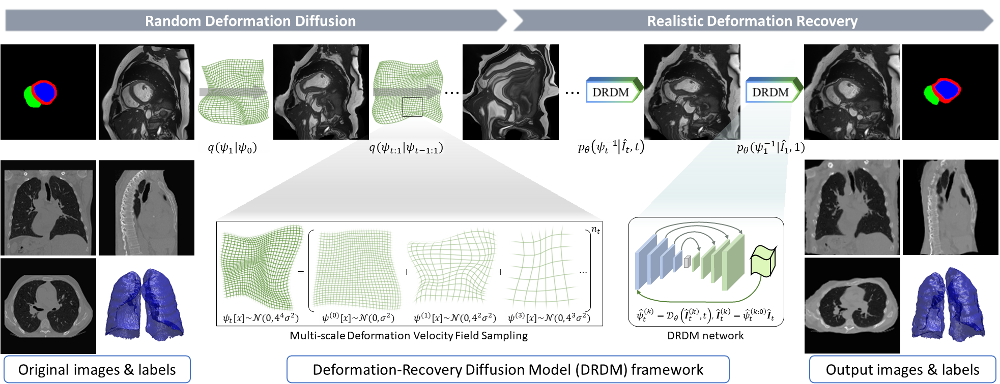

<h1> Deformation-Recovery Diffusion Model (DRDM):  <small>Instance Deformation for Image Manipulation and Synthesis</small> </h1>

Code for paper [Deformation-Recovery Diffusion Model (DRDM): Instance Deformation for Image Manipulation and Synthesis](https://doi.org/10.48550/arXiv.2407.07295)

> This repo provides an implementation of the training and inference pipeline of DRDM based on Pytorch. 

---
### Contents ###
- [0. Brief Introduction](#0-brief-intro)

---

## 0. Brief Intro ##

The research in this paper focuses on solving the problem of multi-organ discontinuous deformation alignment. An innovative quantitative metric, Motion Separability, is proposed in the paper. This metric is designed to measure the ability of deep learning networks to predict organ discontinuous deformations. Based on this metric, a novel network structure skeleton, the Motion-Separable structure, is designed. In addition, we introduce a Motion disentanglement module to help the network distinguish and process complex motion patterns among different organs.

This research proposes a novel diffusion generative model based on deformation diffusion-and-recovery, which is a deformation-centric version of the noising and denoising process.
Named DRDM, this model aims to achieve realistic and diverse anatomical changes. The framework includes random deformation diffusion followed by realistic deformation recovery, enabling the generation of diverse deformations for individual images.

The main contributions include:
<ul style="width: auto; height: 200px; overflow: auto; padding:0.4em; margin:0em; text-align:justify; font-size:small">
  <li> <b>Instance-specific deformation synthesis</b>: This is the first study to explore diverse deformation generation for one specific image without any atlas or another reference image required;
  </li>
  <li> <b>Deformation Diffusion model</b>: A novel diffusion model method is proposed based on deformation diffusion and recovery, rather than intensity/score diffusion or latent feature diffusion based on registration framework;
  </li>
  <li> <b>Multi-scale random deformation velocity field sampling and integrating</b>: The method of multi-scale random Dense Velocity Field sampling and integrating is proposed to create deformation fields with physically possible distributions randomly for DRDM training;
  </li>
  <li> <b>Training from scratch without annotation</b>: The training of DRDM does not require any annotation by humans or an external (registration or optical/scene flow) model/framework;
  </li>
  <li> <b>Data augmentation for few-shot learning</b>: The diverse deformation field generated by DRDM is used on both image and pixel-level segmentation, to augment morphological information without changes in anatomical topology. Thus it enables augmented data for few-shot learning tasks;
  </li>
  <li> <b>Synthetic training for image registration</b>: The synthetic deformation created by DRDM can be used to train an image registration model without any external annotation;
  </li>
  <li> <b>Benefiting downstream tasks</b>: The experimental results show that data augmentation or synthesis by DRDM improves the downstream tasks, including segmentation and registration. The segmentation method and the registration method based on DRDM respectively outperform the previous augmentation method and the previous synthetic training method, which validate the plausibility and the value of the deformation field generated by DRDM.
  </li>
</ul>

---
The code is coming
---

